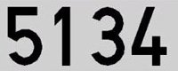
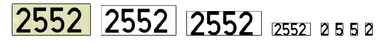
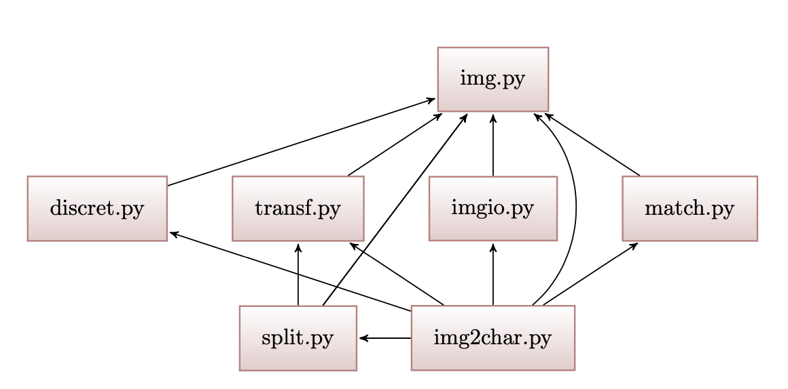

===================
Project description
===================

|

The main objective of this application is, given a picture of a license plate
(only, without the car or other elements), recognise its digits and represent
them on the terminal.

The next image shows an example of license plate which can be processed by the
program:

  |
  

|

For accomplish the objective, the image have to be transformed and processed
following the next steps:

1. Converting the image mode into '1' (black and white).
   
2. Triming the image leaving only the digits of the license plate (in only one
   image).
  
3. Scaling the image, so that it has the same height (or the most similar) of
   the digit patterns (which are compared to the digits of the license plate,
   in order to know what digit represents).
  
4. Spliting the image and get the digits (in separeted files).
   
5. Eventually, comparing the digit with the patterns and decide which number
   is it.
  
|

|

Modules of the project
======================

This project has 7 modules that work simultaneously and together in order to
achive represent the license plate. This modules are:

- **img.py**: It contains the primary operations of the project and do the
  firsts transformations to the images.

  |
    
- **imgio.py**: This module is responsible of the input/output operation of
  images. It reads images from the disk, saves them into the disk and also
  can show them on the screen.

  |
    
- **transf.py**: Its purpose base on the transformation of images. In
  particular, for scale them (change their resolution and
  modify their size) and for trim them (getting an image with the digits). 

  |
    
- **discret.py**: It permits to convert an image in 'RGB' mode to '1' mode
  (black and white). 

  |
    
- **split.py**: This module is the responsible of split the license plate,
  leaving only the digits of it (in diferents images, one per digit).                        

  |
    
- **match.py**: It is the module in charge of decide which number represent the
  different images of the digits. 

  |
    
- **img2char**: It is the main module. Its function is join all the
  funcionalities of the previous modules in only one file. 

  |

All this modules are related  one each other, sharing functions
and parameters. The next image show how are the diferent files connected:

|

Image modes
===========

When we talk about pictures from a computer point of view, we are talking about
matrices of pixels, which defines with numbers the image pixel per pixel. We can
imagine a matrix of pixels as an 'encoded image'.

According to the image mode, the matrix of pixels has a different structure.
For this reason and to understand most of the functions of the project,
is essencial to know the diferences between the images modes  'RGB', 'L' and
'1' (used in this project).

|

* **'RGB'**: The pictures of this type can represent all the colour
  palette, for this reason has the most complex matrix of pixels. The structure
  of the matrix is:

  .. code-block:: python

		  
		  # 'RGB' image of size: (2 px. * 2 px.)
		  >>> RGB_Matrix = [[(255,255,255),(255,255,255)],[(255,0,0),(0,255,0)]]

  .. note::

    As we can see, every pixel in RGB is represented as tuple (r,g,b),
    every row as a list of tuples and the entire image as a list of rows. 

|

* **'L'**: The images of this mode can represent all the greyscale. We can
  convert an RGB image into an L using the luminance of every pixel (Luminance
  = 1/3 * (r+g+b)). A matrix in L mode is like this:

  .. code-block:: python

		  # 'L' image of size: (2 px. * 2 px.)
		  >>> L_Matrix = [[195,85],[255,0]]

  .. note::
    Every row of the picture is a list of values and the entire image a list of
    lists (the same happens at '1' mode).

|
		  
* **'1'**: This type of pictures can only represent images in black and white.
  To convert an L image into a 1, we need to define a border value. If the pixel
  in L is above the border value it will transform automatically into a 255
  and if it is below, into a 0. A great form to decide the border value is with
  the Otsu's Threesholding Method. The structure of the matrix at this mode is:

  .. code-block:: python

		  # '1' image of size: (2 px. * 2 px.)
		  >>> 1_Matrix = [[255,0],[255,0]]
  
  .. note::
    This example can show us that the pixels in '1' mode can only have two
    values (255 (white) and 0 (black)). 

